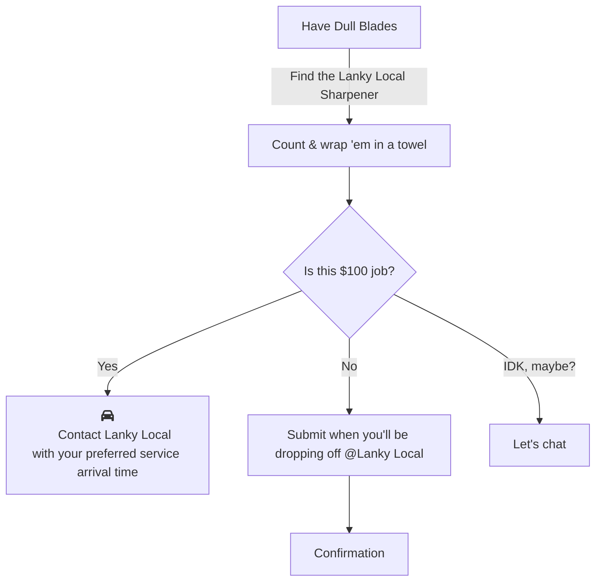

## Check out the [pricing](https://lankysharp.github.io/about/#pricing) table for estimating job orders (taxes are already included)

***

```mermaid
flowchart TD
    A[Have Dull Blades] -->|Find the Lanky Local Sharpener| B[Count & wrap 'em in a towel]
    C -->|Yes| D[fa:fa-car
     Contact Lanky Local with your preferred service arrival time]
    C -->|No| E[Submit when you'll be dropping off @Lanky Local]
    C -->|IDK, maybe?| F[Let's chat]
    B --> C{Is this $100 job?}
    E --> Confirmation
```
